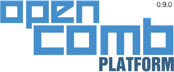

蜂巢(OpenComb)
===

蜂巢(OpenComb)不只是一个 Node.js 的开发框架。

## 依赖环境

* [Node.js](http://nodejs.org/)
* [MongoDB](http://www.mongodb.org/)
* [Git](http://git-scm.com/)

它们都是流行的开源项目，支持几乎所有平台，安装也很简单，你可以直接访问它们的主页，或google。

在开始使用蜂巢以前，你需要花10分钟准备好蜂巢依赖的环境。

## 快速开始

在 `~/opencomb` 目录下部署蜂巢：

```
git clone git@github.com:OpenComb/OpenComb.git opencomb
```

安装蜂巢的依赖：

```
cd opencomb && npm i
```

安装一个 blog 扩展

```
npm i ocxblog
```

启动 mongodb

```
mongod &
```

启动蜂巢

```
node index.js
```

在浏览器里访问 url `http://127.0.0.1:6060`


---

# 特性

* 最小程度更新网页，而不是刷新整个网页
* 服务器仅向前端传送数据
* 支持浏览器的History和地址栏
* 对搜索引擎友好，不干扰SEO
* 控制器（以及视图）能够自由组合
* 模板引擎在后端支持jQuery操作
* AOP
* 完全基于扩展
* 响应式布局(Responsive Layout)
* 内容协商(Content Negotiation)
* 兼容 PC/移动设备 的不同屏幕尺寸和体验


## 扩展驱动

蜂巢是一个完全基于扩展的Web框架，用户可以通过安装扩展来搭建一个网站或Web App。

* ___一切皆扩展___

开发者通过开发扩展来为蜂巢提供功能和内容，这些扩展便于分发，和在其他蜂巢系统里安装。

* ___对扩展进行扩展___

扩展还能够“改变”其他扩展的行为。
当你需要的扩展和你的需求并不完全一致时，你可以写一个新的扩展，来“修改”、“重塑”原有扩展的行为，而不是直接修改他的源代码。

## 拒绝修改源代码

* 蜂巢的模板引擎支持在后端运行`jQuery`，这使你能够用 `$` 来操作其他扩展提供的模板中的内容

* 蜂巢提供的AOP机制，允许你对代码中的任何函数进行“切入”操作（即使是匿名函数），在目标函数的之前、之后，以及外围执行你提供的代码。

* “依赖注入”保证了整个系统都是可以“被管理”的。

这些机制的 API 安全、简单，容易调用和调式；而且还“绿色环保”：只有当你的扩展被安装后他们才生效；扩展被移除（删除扩展目录即可），所有的效果就会还原。


## 网页是可以组合和重用的

在蜂巢的MVC模式中，一个控制器对应一个视图 ，
网页是由视图组成的，控制器的 layout 和 children 属性用于关联其他控制器，通过这种方式，控制器就“聚合”成一颗“树”，而他们的视图也会自动组合，最后“拼合”成一个完整的网页。

所有网页都是由控制器（及其视图）组成的，这意味着你可以：

* 向任意网页添加控制器

* 用来自不同网页的控制器,重新组成一个新的网页

> 蜂巢的控制器保持极高的内聚性，和低耦合度，是为了可以重复使用和组合而设计的。


## 面向二次开发

蜂巢是一个“面向二次开发”的框架，你可以通过安装各种扩展来构建一个“接近”的系统，然后创建新的扩展实现剩下的功能，而不是每个项目都从0开始。

蜂巢的扩展机制允许你：

* ___在自己开发的网页里，引用其他的扩展里的控制器___

* ___将自己写的控制器，添加到其他扩展的网页里___

* ___让某个网页里的视图重新布局___

* ___用 jQuery 控制任何扩展的模板___

* ___将你的代码，通过 AOP 机制“切入”到任何地方___

于是，你可以：往某个导航菜单里增加一项内容；在你看中的地方插入一个banner；往某个CMS的内容表单里面增加几项特殊的字段；不喜欢blog扩展使用的富文本编辑器？那就换一个。

完成以上的任务，你都没有“改动”源代码。所以，你能够将这些“改进”打包成一个新扩展，然后发布出去，分享给所有人；

反过来讲，你可以安装别人发布的扩展，以及更多“增强”的扩展。


---

# 文档

## 开发者手册

1. [如何开始](doc/manual/how-to-start.md)

2. [控制器](doc/manual/useing-controller.md)
	* [使用控制器](doc/manual/using-controller.md)
		* [API:earth](doc/manual/earth-api.md)
		* [API:nut](doc/manual/nut-api.md)
	* [控制器组合](doc/manual/controller-aggregation.md)
		* [layout](doc/manual/controller-aggregation.md#layout)
		* [children](doc/manual/controller-aggregation.md#children)
		* [向 layout 和 child 传递参数](doc/manual/controller-aggregation.md#向+layout+和+child+传递参数)
		* [actions](doc/manual/controller-aggregation.md#actions)
		* [控制器路径](doc/manual/controller-aggregation.md#控制器路径)
	* [Ajax](doc/manual/ajax.md)
	* [Pjax](doc/manual/pjax.md)
	* [标题、关键词、描述](doc/manual/title-keywords-description.md)

3. [视图和模板](doc/manual/template-and-view.md)

4. 数据库

5. Session

6. [扩展](doc/manual/extension.md)

7. [“模板编织”]

8. AOP


